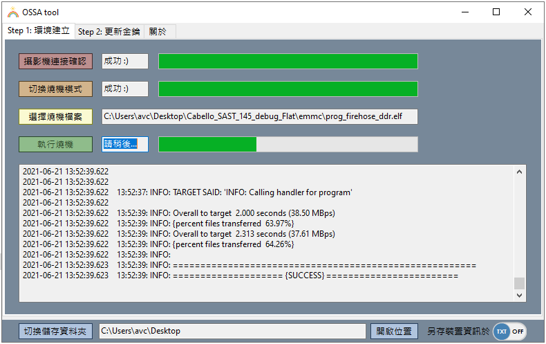
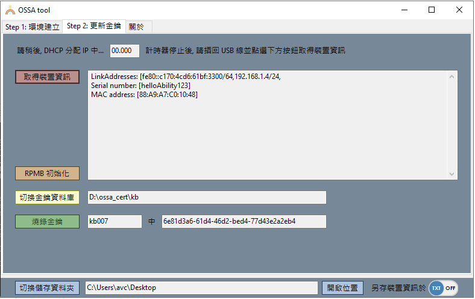
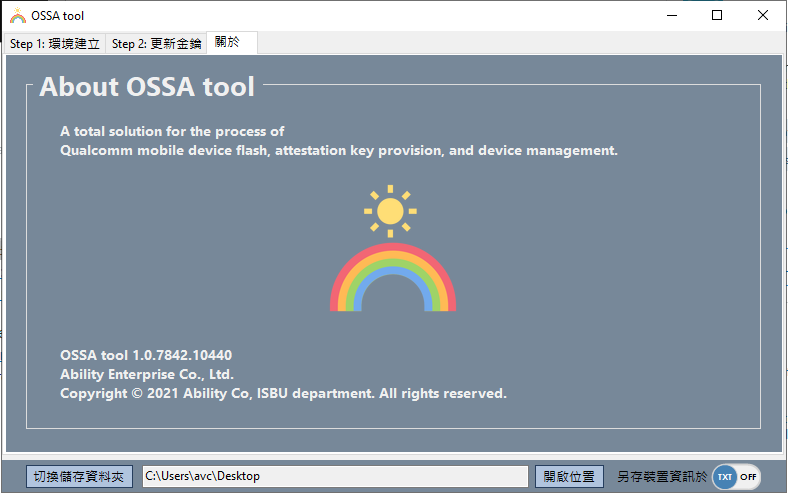

PC tool 包含了
1. type C 線連接後 `攝影機連接確認` 切換裝置到 edl 模式 `切換燒機模式`
2. QFIL `執行燒機`
    - 可修改 elf 檔案來切換不同燒錄版本 `選擇燒機檔案`
    - 燒錄進度可透過 tool 視窗得知
    - 燒錄結果之 log 檔儲存位置可切換

 

3. `取得裝置資訊`
    - IP address
    - mac address
    - device serial number
4. `RPMB 初始化`
    - 若裝置無法取得其 mac address 與 device serial number 無法執行此步驟及後續流程
5. `燒錄金鑰`
    - push 金鑰 xml 檔
    - push 成功之後需請手動開啟命令提示字元並按下 ctrl + V 執行
    - push 成功之後自動更新 csv 檔 (txt 檔可依使用者需求自行決定是否更新)
6. 金鑰資料庫自動管理
    - `切換金鑰資料庫`後自動搜尋底下未使用之金鑰
    - `燒錄金鑰`後會將已使用之金鑰移至 used 資料夾中並重新抓取新的一組可用金鑰
7. `開啟位置` 可查看
    - 燒機 log
    - 裝置-金鑰 csv 文件
    - 裝置-金鑰 txt 文件 (if toggle button is on)

 

8. 查看 OSSA tool 簡介以及當前版本資訊

 
